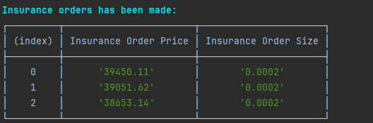

# NestJS DCA Trading Bot

## Описание

Этот проект реализует стратегию DCA (Dollar-Cost Averaging) для торгового бота на спотовом рынке криптовалют, используя фреймворк [Nest](https://github.com/nestjs/nest). Бот автоматически осуществляет покупку криптовалюты и фиксирует прибыль в соответствии с заданными параметрами.

## Установка и Запуск

> **Перед запуском бота необходимо установить все необходимые значения в .env файл для успешной работы бота**

```bash
$ yarn install
$ yarn run start
```

Бот автоматически осуществит покупку криптовалюты по рыночной цене. После покупки будет отображена таблица установленных страховочных ордеров.



Далее бот ожидает выполнения ордеров. В зависимости от рыночной ситуации:

- **Если страховочный ордер выполнен**, предыдущий take profit ордер отменяется, и происходит покупка по текущему страховочному ордеру.
- **Если выполнен ордер take profit**, все остальные страховочные ордеры отменяются, и бот начинает процесс сначала.

## Конфигурационный файл (.env)

Файл `.env` используется для управления параметрами конфигурации проекта. Вот пример содержимого файла:


```plaintext
# Конфигурация приложения
APP_PORT                            Это порт, на котором будет запущено ваше приложение. 
                                    8080 - стандартный порт для веб-приложений

# Конфигурация Bitget
API_KEY, API_SECRET, API_PASS       Эти ключи необходимы для аутентификации в API торговой платформы (Bitget).

SYMBOL                              Торговый символ (пара) на бирже, с которым работает бот (например, BTCUSDT).


# Параметры торговли

PRICE_DROP_PERCENTAGE                Процент движения цены вниз при установлении страховочного ордера

INSURANCE_ORDERS_AMOUNT              Максимальное количество страховочных ордеров

BUY_AMOUNT                           Количество USDT на которую совершается покупка

TAKE_PROFIT_PERCENTAGE               Процент по средней покупке при достижении которой автоматически 
                                     продается криптовалюта и фиксируется прибыль

INSURANCE_ORDERS_INTERVAL_MULTIPLIER Множитель интервала используется для умножения процента отклонения 
                                     последнего страховочного ордера для расчета процента отклонения 
                                     следующего страховочного ордера

INSURANCE_ORDERS_MULTIPLIER          Множитель страховочного ордера используется для умножения суммы сделки 
                                     последнего ордера. Например, если множитель равен 1,5, то первый 
                                     страховочный ордер умножается на 1,5, что равно значению второго 
                                     страховочного ордера, второй умножается на 1,5, что равно 
                                     значению третьего страховочного ордера
```
